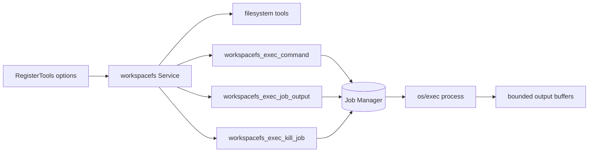

# Plan: Add shell execution capabilities to `workspacefs`

## 1. Introduction / Overview

`tools/workspacefs` currently exposes 9 filesystem-only tools (`read`, `write`, `edit`, `list`, `tree`, `search`, `info`, `list_workspaces`) backed by `os.Root` confinement and workspace identifiers.

Current project analysis:

- `tools/workspacefs` has no command execution support today.
- `workspacefs` registration uses `WithWorkspaces` and validates workspace identifiers/paths up front.
- Runtime host wiring in `apps/sonalmod/internal/runtime.go` already registers `workspacefs` tools, so extending this module is the right integration point.
- The repository has no existing `os/exec` usage in tooling, so exec behavior, security policy, and test coverage all need to be introduced from scratch.

Goal of this change:

- Extend `workspacefs` with shell execution tools that support:
  - foreground command execution,
  - long-running/background execution,
  - output polling,
  - explicit process termination.
- Keep model-facing contract workspace-based (`workspace` + relative working directory).
- Preserve existing standards: strong tests, no host-path leakage, and clear model-facing errors.

Non-goals:

- Building a full OS sandbox/chroot/container runtime.
- Interactive terminal/TTY sessions.
- Real-time streamed output over SSE from inside one tool call.
- Replacing existing filesystem tool behavior.

---

## 2. Business Logic

### 2.1 Core behavior

- Add a new exec tool family under `workspacefs_` prefix:
  - `workspacefs_exec_command`
  - `workspacefs_exec_job_output`
  - `workspacefs_exec_kill_job`
- All exec requests require `workspace` (same contract as existing tools).
- Optional `working_directory` is relative to selected workspace and validated with the same path safety rules.
- Foreground commands return bounded output and completion metadata.
- Background commands return a job ID; output/status are retrieved via polling tool; running jobs can be killed explicitly.

### 2.2 Response model expectations

- Foreground result should include:
  - execution status (success/failure),
  - exit code (when available),
  - bounded/truncated stdout/stderr,
  - timeout indicator.
- Background result should include:
  - stable job ID,
  - initial status snapshot (`running: true`),
  - optional initial output.
- Polling result should include:
  - running/completed state,
  - output snapshot (or incremental chunk, depending on chosen design),
  - exit code and elapsed duration when finished.

### 2.3 Security and safety behavior

- Exec is opt-in at registration level (recommended default: disabled).
- Enforce command policy before execution:
  - block known high-risk command families (network exfiltration/system mutation) by default,
  - make policy configurable for trusted deployments.
- Enforce resource limits:
  - per-command timeout,
  - max captured output bytes,
  - max concurrent background jobs.
- Keep model-visible errors stable and safe:
  - refer to `workspace` and request fields,
  - do not leak configured absolute host paths.

### 2.4 Important boundary note

- `os.Root` protects file tool path traversal, but command execution itself is not filesystem-confined by `os.Root`.
- Plan includes explicit documentation and policy controls so this boundary is transparent and intentional.

---

## 3. High-Level Architecture

Architecture summary:

- Keep current module shape: public registration surface + `internal/workspacefs` service methods.
- Extend `Service` with an internal job manager for background process lifecycle.
- Keep tool definitions in `tools/workspacefs/agent_tools.go`; request/response structs remain in same `.go` file as service methods per module convention.

---

## 4. Detailed Architecture

### 4.1 Public registration surface (`tools/workspacefs/tools.go`)

- Add exec-specific registration options (minimal public API), for example:
  - enable/disable exec tools,
  - max output bytes,
  - default timeout,
  - max concurrent jobs,
  - blocked command prefixes.
- Validate option values and pass them into `internal/workspacefs.NewService(...)`.
- Keep defaults conservative and safe.
- Update `ExpectedToolCount` when exec tools are enabled.

### 4.2 Service internals (`tools/workspacefs/internal/workspacefs/service.go`)

- Extend `Service` with exec configuration and job-tracking state.
- Add synchronized in-memory job registry keyed by generated job ID.
- Ensure `Service.Close()`:
  - closes existing roots (current behavior),
  - also terminates active background jobs and releases job resources.

### 4.3 New exec implementation (`tools/workspacefs/internal/workspacefs/exec.go`)

- Add request/response models and service methods:
  - execute command,
  - poll output/status,
  - kill job.
- Implement workspace + working-directory resolution:
  - workspace required and validated via `pickWorkspace`,
  - working directory sanitized as workspace-relative path.
- Implement process execution:
  - use `exec.CommandContext`,
  - shell invocation strategy per OS,
  - capture stdout/stderr with bounded buffers and truncation metadata.
- Implement background execution lifecycle:
  - start process async,
  - store output/status snapshots,
  - finalize with exit code/error/timestamps.

### 4.4 Tool wiring (`tools/workspacefs/agent_tools.go`)

- Register 3 new agent tools with clear descriptions and usage constraints.
- Ensure descriptions explicitly mention:
  - `workspace` is required,
  - path fields are relative to workspace,
  - background lifecycle requires polling/kill tools.

### 4.5 Test architecture

- Add focused test file(s), likely:
  - `tools/workspacefs/internal/workspacefs/exec_test.go`
- Update existing tests:
  - `tools/workspacefs/tools_test.go` for registration options/tool count/default behavior,
  - `tools/workspacefs/agent_tools_test.go` for tool names/schema/handler behavior.
- Coverage scenarios:
  - exec disabled behavior,
  - workspace required/unknown workspace,
  - working directory validation (`..`, absolute paths),
  - success, non-zero exit, timeout, truncated output,
  - blocked command policy,
  - background start/poll/kill,
  - cleanup on `Service.Close`,
  - no absolute-path leakage in model-visible errors.

### 4.6 Runtime wiring (`apps/sonalmod/internal/runtime.go` + config)

- Add runtime config knobs for exec policy and limits (recommended), then pass to `workspacefs.RegisterTools(...)`.
- Update config providers to expose new keys to DI.
- Keep default deployment posture conservative (exec off by default unless explicitly enabled).

### 4.7 Documentation updates

- Update `tools/workspacefs/AGENTS.md`:
  - add exec tool contract and security model notes,
  - clarify the distinction between filesystem confinement and command execution policy.
- Add implementation summaries in `doc/implementation/exec-tool/` during execution, then compress.

---

## 5. Key Architectural Decisions

1. **Three-tool exec model** (`exec`, `job_output`, `kill_job`) to support long-running commands without blocking a single tool call.
2. **Opt-in enablement** for exec capabilities to avoid expanding host risk by default.
3. **Workspace-first contract** for all exec requests (`workspace` + relative working directory).
4. **Bounded output and time limits** to protect memory/context size and prevent runaway executions.
5. **Policy-based command restrictions** (default denylist + configurable overrides) to provide baseline safety.
6. **Service-owned job lifecycle** with guaranteed cleanup on close.

---

## 6. Uncertainties

1. **Default blocked command set:** exact baseline list should balance safety and usability; initial denylist may need tuning.
2. **Cross-platform shell semantics:** quoting and shell behavior differ across OSes; implementation should include platform-specific tests where feasible.
3. **Output format for polling:** full snapshot vs incremental deltas is a product/API choice.
4. **Runtime defaults:** whether `apps/sonalmod` should enable exec in local env by default or require explicit user config.
5. **Environment inheritance:** whether child processes inherit full host env or a curated subset. - all for now.

---

## 7. Related Files

### Existing files (expected edits)

- `tools/workspacefs/tools.go`
- `tools/workspacefs/agent_tools.go`
- `tools/workspacefs/tools_test.go`
- `tools/workspacefs/agent_tools_test.go`
- `tools/workspacefs/internal/workspacefs/service.go`
- `tools/workspacefs/AGENTS.md`
- `apps/sonalmod/internal/runtime.go`
- `apps/sonalmod/internal/runtime_test.go`
- `apps/sonalmod/internal/config/default.yaml`
- `apps/sonalmod/internal/config/provide.go`

### New files (expected)

- `tools/workspacefs/internal/workspacefs/exec.go`
- `tools/workspacefs/internal/workspacefs/exec_test.go`
- `doc/implementation/exec-tool/summary-task-*.md` (during implementation)
- `doc/implementation/exec-tool/implementation-summary.md` (after compression)

---

## 8. Task List

Follow TDD for all coding tasks: write failing tests first, then implement, then re-run tests to green.

After each coding task:

- run module-specific checks,
- keep codebase buildable,
- record implementation summary for the task.

### **Task 1.1: Add exec registration contract and safe defaults (TDD)**

- Add failing tests in `tools/workspacefs/tools_test.go` for:
  - exec disabled by default,
  - enabling exec registers additional tool definitions,
  - invalid exec option values fail registration.
- Implement registration options and validation in `tools/workspacefs/tools.go`.
- Run focused tests: `go test -v ./... --run TestRegisterTools`.
- Run module checks in `tools/workspacefs`: `make lint` and `make test`.
- Write summary to `doc/implementation/exec-tool/summary-task-1.1.md`.

### **Task 1.2: Implement foreground command execution in service (TDD)**

- Add failing tests in `tools/workspacefs/internal/workspacefs/exec_test.go` for:
  - success path,
  - non-zero exit code,
  - timeout behavior,
  - output truncation,
  - workspace/working-directory validation.
- Implement foreground exec logic in `internal/workspacefs/exec.go`.
- Run focused tests: `go test -v ./internal/workspacefs --run TestExecCommand`.
- Run module checks in `tools/workspacefs`: `make lint` and `make test`.
- Write summary to `doc/implementation/exec-tool/summary-task-1.2.md`.

### **Task 2.1: Implement background jobs, polling, and kill APIs (TDD)**

- Add failing tests for:
  - start background command returns job ID,
  - polling returns running then completed state,
  - kill stops an active job,
  - unknown/finished job handling,
  - service close cancels active jobs.
- Implement job manager and APIs in `internal/workspacefs/exec.go` and `service.go`.
- Run focused tests: `go test -v ./internal/workspacefs --run 'TestExecBackground|TestService'`.
- Run module checks in `tools/workspacefs`: `make lint` and `make test`.
- Write summary to `doc/implementation/exec-tool/summary-task-2.1.md`.

### **Task 2.2: Register and validate new tool definitions (TDD)**

- Add failing tests in `tools/workspacefs/agent_tools_test.go` for:
  - tool names and descriptions,
  - request/response wiring,
  - model-visible errors (no host path leakage).
- Implement tool wiring in `tools/workspacefs/agent_tools.go`.
- Update `ExpectedToolCount` behavior in `tools/workspacefs/tools.go`.
- Run focused tests: `go test -v ./... --run 'Test.*Tool|TestWorkspaceModelVisibleErrors'`.
- Run module checks in `tools/workspacefs`: `make lint` and `make test`.
- Write summary to `doc/implementation/exec-tool/summary-task-2.2.md`.

### **Task 3.1: Add command policy restrictions and hardening (TDD)**

- Add failing tests for blocked command patterns and explicit error messages.
- Implement policy checks before process start.
- Add regression tests for path/identifier leakage in exec errors.
- Run focused tests: `go test -v ./internal/workspacefs --run 'TestExec.*Policy|Test.*Leak'`.
- Run module checks in `tools/workspacefs`: `make lint` and `make test`.
- Write summary to `doc/implementation/exec-tool/summary-task-3.1.md`.

### **Task 3.2: Wire runtime config and registration options (TDD)**

- Add failing tests in `apps/sonalmod/internal/runtime_test.go` for:
  - runtime creation with exec disabled (default),
  - runtime creation with exec enabled and valid limits.
- Add config keys in `apps/sonalmod/internal/config/default.yaml`.
- Expose keys through `apps/sonalmod/internal/config/provide.go`.
- Pass new options in `apps/sonalmod/internal/runtime.go`.
- Run focused tests in `apps/sonalmod`: `go test -v ./internal --run TestNewRuntime`.
- Run module checks in `apps/sonalmod`: `make lint` and `make test`.
- Write summary to `doc/implementation/exec-tool/summary-task-3.2.md`.

### **Task 4.1: Update module docs and finalize behavior docs**

- Update `tools/workspacefs/AGENTS.md` with exec contract, limits, and security boundaries.
- Ensure tool descriptions and comments are aligned with implemented behavior.
- Run module checks in `tools/workspacefs`: `make lint` and `make test`.
- Write summary to `doc/implementation/exec-tool/summary-task-4.1.md`.

### **Task 4.2: Compress implementation summaries**

- Follow [compress-implementation-summaries.md](/.context/compress-implementation-summaries.md) to compress the implementation summaries.

---

## Document Control

| Version | Date | Notes |
|---------|------|-------|
| 1.0 | 2026-04-05 | Initial plan for adding exec capabilities to workspacefs based on project audit + exec research |
