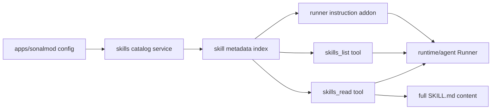

# Plan: Add Skills Support to Sonalmod Runtime

## 1. Introduction / Overview

The current runtime has tool registration and workspace-scoped file tools, but it does not implement skill discovery or activation.

Current codebase state from research:

- `runtime/agent/runner.go` uses a fixed instruction string (`"You are a helpful assistant."`).
- `apps/sonalmod/internal/runtime.go` registers `workspacefs` tools only.
- There is no runtime code that discovers `SKILL.md`, injects an `<available_skills>` block, or provides a `read_skill`-style activation tool.
- `doc/implementation/skills-support/research.md` describes the desired skill model (discovery metadata + on-demand full load), but this is not implemented yet.

Goal of this change:

- Add first-class skills support with progressive disclosure:
  - discover available skills from configured directories,
  - inject compact skill metadata into agent instruction context,
  - load full skill instructions on demand via tools.

Non-goals for this phase:

- Executing skill scripts automatically.
- Full agentskills.io parity for every optional metadata field.
- Remote skill registries or package installation workflows.
- UI-level skill management screens.

---

## 2. Business Logic

### 2.1 Core functionality to enable

- Runtime discovers skill directories containing `SKILL.md`.
- Runtime parses frontmatter metadata (at minimum `name`, `description`) and validates entries.
- Agent receives a compact list of available skills in system instruction context (not full skill bodies).
- Agent can call a skill tool to load full instructions for a selected skill.
- Skill activation is catalog-based: skill tools accept only discovered skill names (no arbitrary file paths).
- Skill responses are bounded in size and safe for model context usage.

### 2.2 Acceptance criteria

- When skills are enabled and valid skill files exist, the agent can discover and use them within a session.
- When skills are disabled or no skills exist, runtime behavior remains unchanged.
- Missing/invalid skill files do not crash the runtime; errors are deterministic and actionable.
- Tool-facing and model-facing responses do not leak sensitive host filesystem details.

### 2.3 Boundaries and safety

- Skills are read-only content in this phase.
- Skill loading is restricted to configured directories.
- File size and catalog size limits are enforced.
- Duplicate skill-name behavior is deterministic and non-fatal (warning logs + precedence order).

---

## 3. Architecture Options and Recommendation

### Option A: Reuse `workspacefs` only (no new skill toolset)

- Mount skill directories as workspaces, ask the model to read `SKILL.md` files directly.
- Pros: minimal implementation.
- Cons: weak discovery UX, no metadata catalog, token-inefficient, not aligned with progressive disclosure.

### Option B: Runtime-only injection (no skill tools)

- Discover skills and inject full skill bodies into instruction at runtime.
- Pros: no new tool module.
- Cons: large prompt growth, poor scalability, no explicit activation lifecycle.

### Option C (Recommended): Hybrid model

- Add a dedicated `tools/skills` module (similar to `tools/workspacefs`) for discovery and activation tools.
- Add runtime instruction augmentation so the model gets a compact `<available_skills>` metadata block.
- Keep full skill bodies out of the system prompt until explicitly requested by tool call.

Why Option C is best for this codebase:

- Matches existing composable tool-module architecture (`tools/*` + `RegisterTools` in app runtime).
- Keeps runtime public contract changes minimal (small instruction extension only).
- Provides a clean path to later script support without overloading `workspacefs`.

---

## 4. High-Level Architecture (Recommended)

Summary:

- `tools/skills` is the new module that owns skill discovery + read tools.
- `apps/sonalmod/internal/runtime.go` wires this module into `ToolsRegistry`.
- `runtime/agent/runner.go` gets a minimal extension for app-provided instruction additions.

---

## 5. Detailed Architecture

### 5.1 New tool module: `tools/skills`

Create a new module mirroring current tool module patterns:

- `tools/skills/go.mod`
- `tools/skills/tools.go` (registration options + validation + `RegisterTools`)
- `tools/skills/agent_tools.go` (tool defs and handlers)
- `tools/skills/internal/skills/*` (catalog/discovery/parser/service)
- `tools/skills/AGENTS.md`

Proposed initial tools:

- `skills_list`
  - returns discovered skills metadata (`name`, `description`, optional source label).
- `skills_read`
  - input: skill `name`
  - output: full skill body and normalized metadata
  - returns bounded content and stable errors.

### 5.2 Skill discovery and parsing

Implement catalog service under `tools/skills/internal/skills`:

- Scan configured roots for directories containing `SKILL.md`.
- Parse `SKILL.md` as YAML frontmatter + Markdown body.
- Validate required metadata and size limits.
- Build in-memory index keyed by skill name.
- Resolve duplicates by configured root order: first discovered skill name wins, later duplicates are ignored with warning logs.
- Build the catalog once during startup wiring (no runtime refresh/reload in this phase).

V1 parser/validation contract (captured here so the temporary research doc can be removed safely):

- Required fields:
  - `name`
  - `description`
- `name` constraints:
  - lowercase alphanumeric + hyphen format (`^[a-z0-9-]+$`)
  - max length 64
  - must match parent directory name
- `description` constraints:
  - max length 1024
- Optional frontmatter fields:
  - `license`
  - `compatibility`
  - `allowed-tools`
- Optional-field guidance captured from the skills standard:
  - `compatibility` recommended max length: 500
  - `allowed-tools` format: space-delimited list
- Optional fields are parsed and retained when present, but only `name` + `description` are required for discovery in this phase (strict optional-field enforcement can be added later).

### 5.3 Runtime instruction composition

Current instruction is static in `runtime/agent/runner.go`; add a minimal extension:

- Add runner option for instruction augmentation (for example `WithInstructionSuffix` or equivalent).
- Build an `<available_skills>` block from catalog metadata in app runtime wiring.
- Keep default behavior unchanged when no suffix is provided.

### 5.4 App runtime wiring (`apps/sonalmod/internal/runtime.go`)

- Initialize skills module from config.
- Register `tools/skills` after `workspacefs` on the same `ToolsRegistry`.
- Pass generated skills metadata block into runner instruction option.
- Keep startup behavior explicit:
  - recommended default is disabled until configured,
  - missing recommended skill directories are ignored,
  - malformed skill files and duplicates produce warnings and are skipped.

### 5.5 Configuration layer updates

Add config keys in `apps/sonalmod/internal/config/default.yaml` and DI wiring in `provide.go`, for example:

- `skills.enabled` (bool)
- `skills.paths` (list of directories; defaults to recommended locations from skills ecosystem guidance):
  - `~/.config/agents/skills`
  - `.agents/skills`
- `skills.maxSkillBytes` (int)
- `skills.maxCatalogEntries` (int)

Do not use `dataDir` as a default skills location. Resolve relative paths from the process working directory (project root in typical local runs). If needed, extend config providers with `asStringSlice`.

### 5.6 Test strategy

#### `tools/skills` tests

- parser tests:
  - valid frontmatter/body
  - invalid/missing required metadata
  - field constraint validation (`name` format/length/dir match, `description` max length)
  - malformed frontmatter.
- discovery tests:
  - multiple roots
  - duplicate-name warning + precedence behavior
  - size limits
  - deterministic ordering.
- tool tests:
  - list/read success
  - unknown skill
  - invalid catalog state.

#### `runtime/agent` tests

- instruction extension defaults to current behavior.
- instruction extension appends skills block only when set.

#### `apps/sonalmod` tests

- runtime creation with skills disabled (backward compatible).
- runtime creation with default recommended skills paths.
- duplicate/malformed skill files produce warnings and do not fail runtime startup.

### 5.7 Security and operational notes

- Do not expose absolute host paths in tool responses.
- Enforce bounded read sizes for `SKILL.md`.
- Keep this phase read-only; no script execution.
- Keep skill catalog lifecycle startup-only; filesystem changes after startup are visible only after process restart.
- If script support is added later, route execution through dedicated guarded tooling (not implicit skill loading).

---

## 6. Key Architectural Decisions

1. **Use a dedicated `tools/skills` module** rather than overloading `workspacefs`.
2. **Use progressive disclosure**: metadata in instruction, full content via explicit tool call.
3. **Keep runtime changes minimal** via one instruction augmentation hook.
4. **Start with read-only skills**; defer script execution to a later hardening phase.
5. **Handle duplicate skill names with warning logs** and deterministic precedence by configured root order.
6. **Keep skills support configurable and opt-in** in app runtime config.
7. **Load skills catalog at startup only** (no hot reload in this phase).

---

## 7. Uncertainties

1. **Schema strictness:** how fully to enforce agentskills.io optional fields in v1.
2. **Future scripts:** how to safely support script assets once exec tooling is enabled.

---

## 8. Related Files

### Existing files (expected updates)

- `runtime/agent/runner.go`
- `runtime/agent/runner_test.go`
- `apps/sonalmod/internal/runtime.go`
- `apps/sonalmod/internal/runtime_test.go`
- `apps/sonalmod/internal/config/default.yaml`
- `apps/sonalmod/internal/config/provide.go`
- `apps/sonalmod/go.mod`
- `go.work`

### New files (expected)

- `tools/skills/go.mod`
- `tools/skills/AGENTS.md`
- `tools/skills/tools.go`
- `tools/skills/agent_tools.go`
- `tools/skills/tools_test.go`
- `tools/skills/agent_tools_test.go`
- `tools/skills/internal/skills/service.go`
- `tools/skills/internal/skills/service_test.go`
- `tools/skills/internal/skills/parser.go`
- `tools/skills/internal/skills/parser_test.go`
- `doc/implementation/skills-support/summary-task-*.md` (during implementation)
- `doc/implementation/skills-support/implementation-summary.md` (after compression)

---

## 9. Task List

Follow TDD for all coding tasks: write failing tests first, implement minimal changes, then re-run tests to green.

After each coding task:

- keep codebase buildable,
- run module-specific checks (`make lint`, `make test`) for changed modules,
- write task summary in `doc/implementation/skills-support/summary-task-x.x.md`.

### **Task 1.1: Scaffold `tools/skills` module and registration contract (TDD)**

- Add failing tests for `RegisterTools` defaults and option validation.
- Create module structure (`go.mod`, `tools.go`, `agent_tools.go`, `AGENTS.md`).
- Implement minimal registration path and compile-safe stubs.
- Run focused tests in module.
- Run module checks in `tools/skills`: `make lint` and `make test`.
- Write summary to `doc/implementation/skills-support/summary-task-1.1.md`.

### **Task 1.2: Implement skill parser and catalog discovery service (TDD)**

- Add failing parser tests for valid/invalid frontmatter and body extraction.
- Add failing parser tests for required field constraints:
  - `name` format/length
  - `name` matches parent directory
  - `description` max length
- Add failing discovery tests for root scanning, duplicate-name warning/preference behavior, and limits.
- Implement parser + catalog service in `tools/skills/internal/skills`.
- Run focused tests (parser/discovery suites).
- Run module checks in `tools/skills`: `make lint` and `make test`.
- Write summary to `doc/implementation/skills-support/summary-task-1.2.md`.

### **Task 1.3: Implement `skills_list` and `skills_read` tools (TDD)**

- Add failing tool tests for success and error paths.
- Implement tool handlers and response contracts in `tools/skills/agent_tools.go`.
- Ensure model-visible errors are stable and do not leak host paths.
- Run focused tests for tool wiring and handlers.
- Run module checks in `tools/skills`: `make lint` and `make test`.
- Write summary to `doc/implementation/skills-support/summary-task-1.3.md`.

### **Task 2.1: Add runner instruction augmentation support (TDD)**

- Add failing tests in `runtime/agent/runner_test.go` for default instruction behavior and appended instruction block.
- Implement minimal runner option to append instruction context.
- Verify no behavior changes when option is omitted.
- Run focused tests in `runtime/agent`.
- Run module checks in `runtime`: `make lint` and `make test`.
- Write summary to `doc/implementation/skills-support/summary-task-2.1.md`.

### **Task 2.2: Wire skills config and tool registration in app runtime (TDD)**

- Add failing tests in `apps/sonalmod/internal/runtime_test.go` for:
  - skills disabled default behavior,
  - skills enabled with default recommended paths,
  - duplicate/malformed skills produce warnings and do not fail startup.
- Update config keys in `apps/sonalmod/internal/config/default.yaml`.
- Update DI config providers in `apps/sonalmod/internal/config/provide.go`.
- Register `tools/skills` and instruction addon in `apps/sonalmod/internal/runtime.go`.
- Update `apps/sonalmod/go.mod` and `go.work` for new module.
- Run focused tests in `apps/sonalmod/internal`.
- Run module checks in `apps/sonalmod`: `make lint` and `make test`.
- Write summary to `doc/implementation/skills-support/summary-task-2.2.md`.

### **Task 3.1: Add integration/regression coverage for skills flow (TDD)**

- Add cross-module regression tests for:
  - catalog metadata appearing in instruction addon,
  - `skills_read` loading expected content,
  - disabled skills leaving toolset absent,
  - no-refresh behavior (catalog changes on disk are not reflected until restart).
- Fix any behavior gaps found by integration tests.
- Run module checks in touched modules (`runtime`, `tools/skills`, `apps/sonalmod`): `make lint` and `make test`.
- Write summary to `doc/implementation/skills-support/summary-task-3.1.md`.

### **Task 3.2: Update docs and module guidance**

- Update `tools/skills/AGENTS.md` with contract, limits, and safety boundaries.
- Update any runtime/app docs if configuration keys or workflows changed.
- Run module checks in touched modules: `make lint` and `make test`.
- Write summary to `doc/implementation/skills-support/summary-task-3.2.md`.

### **Task 3.3: Compress implementation summaries**

- Follow [compress-implementation-summaries.md](/.context/compress-implementation-summaries.md) to compress the implementation summaries.

---

## Document Control

| Version | Date | Notes |
|---------|------|-------|
| 1.2 | 2026-04-05 | Added explicit SKILL.md parser/validation contract so plan is self-sufficient after removing temporary research doc |
| 1.1 | 2026-04-05 | Updated defaults to recommended skill locations, duplicate handling to warnings with precedence, and startup-only catalog loading |
| 1.0 | 2026-04-05 | Initial plan for adding skills discovery + activation support using a new toolset and runtime instruction augmentation |
