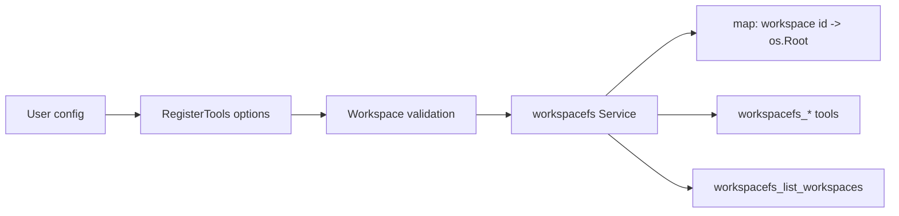

# Plan: Workspace identifiers instead of absolute roots in `tools/workspacefs`

## 1. Introduction / overview

This plan updates `tools/workspacefs` so models no longer see or pass absolute filesystem paths for workspace selection.

Today, workspace selection is path-based:

- Tool requests use `root` (absolute directory path).
- `workspacefs_list_allowed_directories` returns absolute configured directories.

Requested outcome:

- Users configure workspaces as `(workspace identifier, workspace description, filesystem path)` entries.
- Models see and use only workspace identifiers (for example `user-docs`, `codebase`).
- Every filesystem tool call includes `workspace` (the configured identifier).
- The model can list available workspaces without learning absolute host paths.

This document is implementation guidance only (no coding in this step).

---

## 2. Business logic

### 2.1 Core behavior

- Workspace configuration is identifier-driven, not path-driven.
- A workspace identifier is a short, model-visible name supplied by the user at configuration time.
- Each identifier maps internally to one absolute directory path opened via `os.OpenRoot`.
- All file operations remain relative to the selected workspace root and continue using `os.Root` confinement.

### 2.2 Tool-facing contract

- Replace path-based selection field `root` with required `workspace` in all request structs.
- Replace `workspacefs_list_allowed_directories` with `workspacefs_list_workspaces`.
- `workspacefs_list_workspaces` returns configured workspace entries with identifier and short description for model context (no filesystem paths).

### 2.3 Validation and errors

- Registration fails when configuration is invalid:
  - no workspaces configured,
  - duplicate identifiers,
  - empty identifier,
  - empty description,
  - non-existent/non-directory path.
- Identifier style is documented near the config field (short and consistent), rather than enforced via strict regex rules.
- Tool calls fail fast when `workspace` is empty or unknown.
- Errors shown to model should avoid leaking absolute configured directories.
- Error messages should use `workspace` terminology (not `root`) for consistency.

### 2.4 Non-goals

- No change to path sanitization semantics (`sanitizeRelativePath`, glob checks, depth/entry limits).
- No change to core file operation behaviors (read/write/edit/list/tree/search/info logic) other than workspace selection contract.
- No runtime/app-level wiring beyond `tools/workspacefs` module scope (module is still a standalone library in-repo).

---

## 3. High-level architecture

Key idea: keep absolute paths internal to registration/service internals, expose only workspace identifiers in tool schemas and results.

---

## 4. Detailed architecture

### 4.1 Public registration surface (`tools/workspacefs/tools.go`)

- Replace `WithRoots([]string)` with explicit workspace configuration:
  - `WithWorkspaces([]WorkspaceConfig)`.
  - `WorkspaceConfig` includes model-visible identifier, short description, and filesystem path (the path is not delivered to the model).
- Refactor logger option handling so logger is always non-nil:
  - default logger is `slog.Default()`,
  - `WithLogger` overrides it,
  - passing nil to `WithLogger` falls back to `slog.Default()`.
- Update validation helper:
  - ensure identifier is non-empty and unique,
  - ensure description is non-empty,
  - normalize and validate underlying path,
  - document identifier conventions near the config field comments,
  - return validated identifier/path pairs for `NewService`.
- Update `RegisterTools` to construct the service using validated workspaces.

### 4.2 Service internals (`internal/workspacefs/service.go`, `read.go`, `roots.go`)

- Replace path-indexed storage:
  - from `roots []*os.Root` + `allowedDirs []string`
  - to workspace-indexed structures (for example map + stable slice for listing).
- Replace `pickRoot(rootField string)` with `pickWorkspace(workspace string)`.
- Require workspace selection for all calls (even single-workspace setup) per requested contract.
- Keep absolute paths internal; do not return them to callers.

### 4.3 Tool request/response models (multiple files in `internal/workspacefs`)

- Update request structs to use:
  - `Workspace string \`json:"workspace"\``
  - remove `Root string \`json:"root,omitempty"\``.
- Affected request structs:
  - `ReadTextFileRequest`
  - `ReadMultipleFilesRequest`
  - `WriteFileRequest`
  - `EditFileRequest`
  - `ListDirectoryRequest`
  - `DirectoryTreeRequest`
  - `SearchFilesRequest`
  - `GetFileInfoRequest`

### 4.4 Introspection tool replacement (`agent_tools.go`, `internal/workspacefs/roots.go`, `list.go`)

- Remove `workspacefs_list_allowed_directories`.
- Add `workspacefs_list_workspaces`.
- Add/replace response model to return identifier + description pairs (for example `Workspaces []WorkspaceDescriptor`).
- Update `ExpectedToolCount` only if tool inventory changes; likely remains 9 by replacing one tool with another.

### 4.5 Handler descriptions and schema wording (`agent_tools.go`)

- Update tool descriptions to reference `workspace` identifier explicitly.
- Ensure no description text suggests passing absolute filesystem roots.

### 4.6 Tests and migration of expectations

- `tools_test.go`:
  - update registration tests to use workspace identifier + path config.
- `agent_tools_test.go`:
  - replace list-allowed-directories assertions with list-workspaces assertions.
  - assert list-workspaces payload includes both identifier and description.
  - update request fixtures to pass `Workspace`.
- `internal/workspacefs/*_test.go`:
  - replace all `Root:` field usage with `Workspace:`.
  - replace assertions expecting "root is required" with "workspace is required" (or equivalent new phrasing).
  - add unknown-workspace and workspace-config validation coverage (empty/duplicate identifiers, empty descriptions, invalid paths).
  - add checks that introspection responses never include absolute paths.

### 4.7 Documentation updates

- Update `tools/workspacefs/AGENTS.md`:
  - configuration now uses workspace identifiers,
  - model-visible contract explicitly excludes absolute paths.
- Add implementation summary files during execution tasks, then compress as final step.

---

## 5. Key architectural decisions

1. **Identifier-first contract:** Model-facing API always uses workspace identifiers, never absolute roots.
2. **Explicit workspace config model:** Use `WithWorkspaces([]WorkspaceConfig)` for clarity over key/value maps.
3. **Required `workspace` per call:** Enforce explicit workspace targeting in every tool call for predictability.
4. **Non-nil logger always:** Default to `slog.Default()` and never store a nil logger in options.
5. **No path leakage in introspection:** Replace `list_allowed_directories` with `list_workspaces`.
6. **Keep `os.Root` confinement unchanged:** Security boundary remains filesystem-root confinement per workspace.
7. **Module-local scope:** Implement within `tools/workspacefs`; no extra runtime wiring in this change.

---

## 6. Uncertainties

No blocking uncertainties remain for this change.

Error wording is now treated as a planned requirement (not an open question):

- Use `workspace` terminology consistently across tool-facing errors.
- Prefer concise, stable phrasing, for example:
  - `workspacefs: workspace is required`
  - `workspacefs: workspace "<id>" is not configured`
- Keep path-related validation messages focused on the `path` input and avoid exposing configured absolute roots.

---

## 7. Related files

### Existing files (expected edits)

- `tools/workspacefs/tools.go`
- `tools/workspacefs/agent_tools.go`
- `tools/workspacefs/tools_test.go`
- `tools/workspacefs/agent_tools_test.go`
- `tools/workspacefs/internal/workspacefs/service.go`
- `tools/workspacefs/internal/workspacefs/roots.go`
- `tools/workspacefs/internal/workspacefs/read.go`
- `tools/workspacefs/internal/workspacefs/write.go`
- `tools/workspacefs/internal/workspacefs/edit.go`
- `tools/workspacefs/internal/workspacefs/list.go`
- `tools/workspacefs/internal/workspacefs/tree.go`
- `tools/workspacefs/internal/workspacefs/search.go`
- `tools/workspacefs/internal/workspacefs/info.go`
- `tools/workspacefs/internal/workspacefs/read_test.go`
- `tools/workspacefs/internal/workspacefs/write_test.go`
- `tools/workspacefs/internal/workspacefs/edit_test.go`
- `tools/workspacefs/internal/workspacefs/list_tree_test.go`
- `tools/workspacefs/internal/workspacefs/search_test.go`
- `tools/workspacefs/internal/workspacefs/info_test.go`
- `tools/workspacefs/internal/workspacefs/service_test.go`
- `tools/workspacefs/AGENTS.md`

### New files (implementation-phase summaries)

- `tools/workspacefs/docs/implementation/workspace-identifiers/summary-task-*.md`
- `tools/workspacefs/docs/implementation/workspace-identifiers/implementation-summary.md` (after compression step)

---

## 8. Task list

Follow TDD for all coding tasks: write failing tests first, then implementation, then re-run tests to green.  
After each task: run module checks per completion protocol (`make lint` and `make test` in `tools/workspacefs`) and keep module buildable.

**Task 1.1: Add identifier-based workspace configuration in registration (TDD)**
- Add/update registration option API to accept workspace identifier + path config.
- Write failing tests in `tools_test.go` for:
  - empty config,
  - duplicate identifiers,
  - empty identifier,
  - empty description,
  - invalid directory path,
  - logger default/fallback behavior (`slog.Default()` when logger is unset/nil),
  - valid multi-workspace config registers expected tool count.
- Implement validation and wiring in `tools.go`.
- Run focused tests: `go test -v ./... --run TestRegisterTools`.
- Run module checks: `make lint` and `make test`.
- Write summary to `tools/workspacefs/docs/implementation/workspace-identifiers/summary-task-1.1.md`.

**Task 1.2: Refactor service to workspace-indexed root selection (TDD)**
- Write failing tests in `internal/workspacefs/service_test.go` for:
  - list workspaces output,
  - unknown workspace selection error,
  - required workspace selection even with one configured workspace.
- Implement service data model changes and workspace selection helper.
- Ensure absolute path data stays internal-only.
- Run focused tests: `go test -v ./internal/workspacefs --run 'TestNewService|TestService'`.
- Run module checks: `make lint` and `make test`.
- Write summary to `tools/workspacefs/docs/implementation/workspace-identifiers/summary-task-1.2.md`.

**Task 2.1: Replace introspection tool with `workspacefs_list_workspaces` (TDD)**
- Write failing tests in `agent_tools_test.go` for new tool name and response payload.
- Remove/replace `workspacefs_list_allowed_directories` registration path.
- Add service response type/method for listing model-visible workspaces.
- Run focused tests: `go test -v ./... --run TestListWorkspacesTool`.
- Run module checks: `make lint` and `make test`.
- Write summary to `tools/workspacefs/docs/implementation/workspace-identifiers/summary-task-2.1.md`.

**Task 2.2: Replace request field `root` with required `workspace` across all tool models (TDD)**
- Write failing tests for representative requests in:
  - `read_test.go`, `write_test.go`, `edit_test.go`,
  - `list_tree_test.go`, `search_test.go`, `info_test.go`,
  - `agent_tools_test.go`.
- Update request structs and JSON tags in each internal tool file.
- Update handlers and service calls accordingly.
- Run focused tests per file/package to ensure migration completeness.
- Run module checks: `make lint` and `make test`.
- Write summary to `tools/workspacefs/docs/implementation/workspace-identifiers/summary-task-2.2.md`.

**Task 3.1: Update all operation paths to use workspace selection and keep existing behavior (TDD)**
- For each operation (`read`, `read multiple`, `write`, `edit`, `list`, `tree`, `search`, `info`):
  - write/adjust failing tests for required workspace, unknown workspace, valid workspace.
  - verify previous behavior remains intact (UTF-8 checks, limits, path sanitization, partial failures).
- Implement operation-level selection updates.
- Run focused tests: `go test -v ./internal/workspacefs`.
- Run module checks: `make lint` and `make test`.
- Write summary to `tools/workspacefs/docs/implementation/workspace-identifiers/summary-task-3.1.md`.

**Task 3.2: Enforce no absolute-path leakage in model-visible responses and errors (TDD)**
- Add tests asserting:
  - introspection returns identifiers only,
  - unknown workspace errors reference identifier, not filesystem path,
  - registration/operation errors shown to model avoid exposing configured absolute roots.
- Implement error text and response refinements.
- Run focused tests: `go test -v ./... --run 'Test.*Workspace.*|TestListWorkspaces'`.
- Run module checks: `make lint` and `make test`.
- Write summary to `tools/workspacefs/docs/implementation/workspace-identifiers/summary-task-3.2.md`.

**Task 4.1: Update module docs and conventions**
- Update `tools/workspacefs/AGENTS.md` with new workspace identifier contract and selection rules.
- Verify comments/docstrings in public/internal code are consistent (`workspace` terminology only).
- Run module checks: `make lint` and `make test`.
- Write summary to `tools/workspacefs/docs/implementation/workspace-identifiers/summary-task-4.1.md`.

**Task 4.2: Compress implementation summaries**
- Follow [compress-implementation-summaries.md](/.context/compress-implementation-summaries.md) to compress the implementation summaries.

---

## Document control

| Version | Date | Notes |
|---------|------|-------|
| 1.0 | 2026-04-01 | Initial plan for workspace-identifier model-visible contract |
