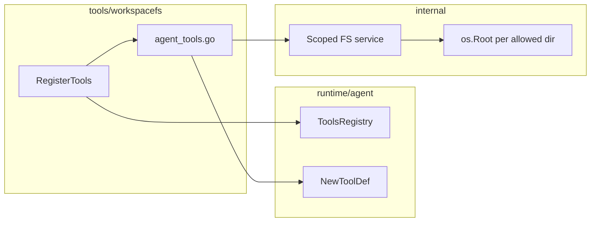

# Plan: Scoped workspace filesystem tools module (`tools/workspacefs`)

## 1. Introduction / overview

This document plans a new Go module **`tools/workspacefs`** that exposes a **scoped filesystem toolset** for the Sonalmod agent runtime, structured like **`tools/firecrawl`**: a thin public surface (`RegisterTools`, options, `ToolsRegistry` integration) plus **`internal`** containing the real behavior.

**Problem:** Agents need read/list/search/edit/write capabilities on disk **without** path traversal or symlink escape outside configured workspace roots.

**Goal:** Provide MCP–reference-aligned tools (names and semantics per [initial research](../initial-iteration/result.md)) backed by Go **`os.Root`** (not `filepath.Join` + `os.Open` for untrusted paths), wired through **`runtime/agent`** as **`agent.DefinedTool`** instances via **`agent.NewToolDef`**.

**Non-goal for this plan document:** Actual coding; this is implementation guidance only.

---

## 2. Business logic (behavioral summary)

Behavior should align with the **reference MCP filesystem server** inventory described in the research:

| Concern | Rule |
|--------|------|
| **Scoping** | All file paths are resolved **only** under configured allowed root(s). No access outside those directories. Use **`os.OpenRoot` / `Root`** (and **`Root.FS()`** when an `fs.FS` is needed), not `os.DirFS` for security-sensitive traversal. |
| **Read text** | **`read_text_file`**: UTF-8 text; optional **`head`** *or* **`tail`** line windows (**mutually exclusive**). Default can read full file subject to host-enforced size caps. |
| **Batch read** | **`read_multiple_files`**: **partial success** — failures for some paths must not abort the whole batch. |
| **Write** | **`write_file`**: create/overwrite within scope; behavior for existing files should be explicit (truncate vs append — pick one and document). |
| **Edit** | **`edit_file`**: **`oldText` / `newText`** style replace (not mandatory unified-diff); support **`dryRun`** (recommended before apply). |
| **List / tree** | **`list_directory`**, **`directory_tree`**: entries stay under root(s). |
| **Search** | **`search_files`**: **glob-style** path/name discovery (research: not “full-text grep” in the reference README). |
| **Metadata** | **`get_file_info`**: size, mod time, type/dir bit, etc., as appropriate. |
| **Introspection** | **`list_allowed_directories`**: returns the configured allowlist (absolute normalized paths). |

**Errors:** Distinguish **handler errors** returned from the tool function (agent/ADK surface) from **protocol** concerns elsewhere; research recommends structured failure so models can recover — surface clear error strings / result fields for “path outside root”, “not found”, etc.

**Go version:** Project uses **Go 1.26.x**; research notes **CVE-2025-22873** fix in **`os.Root`** for **≥ 1.24.3** — the monorepo already exceeds this; no extra pin beyond the existing toolchain.

---

## 3. High-level architecture

- **`RegisterTools(registry, opts...)`** — Same pattern as Firecrawl: if configuration is invalid or “disabled” (e.g. **no roots**), **do not** call `AddTools` (mirror **`RegisterTools`** skipping when `baseURL` is empty).
- **`internal`** — Holds opened **`os.Root`** handles (or a small facade), request/response structs, and pure testable logic for path resolution, glob walk, tree, and bounded reads.
- **`runtime/agent`** — Unchanged contract; tools are **`agent.DefinedTool`** only.

**Integration point (consumers):** Any binary or `main` that builds a **`agent.ToolsRegistry`** will call `workspacefs.RegisterTools(reg, ...)` similarly to how Firecrawl will be wired when a host adds it (Firecrawl is not yet referenced from `go.work` consumers in-repo; the module is still standalone — workspacefs follows the same **library** pattern).

---

## 4. Detailed architecture

### 4.1 Module layout (mirror `tools/firecrawl`)

| Area | Responsibility |
|------|----------------|
| **`go.mod`** | Module `github.com/gemyago/sonalmod/tools/workspacefs`; `require` **`runtime`** and **`google.golang.org/adk`** (for `tool.Context` in handlers); test deps aligned with Firecrawl (`testify`, `faker`). |
| **`Makefile`** | `make lint`, `make test` with coverage profile + **`go-test-coverage`** and **`.testcoverage.yaml`** thresholds like Firecrawl. |
| **`AGENTS.md`** | Module-specific rules: params structs for functions with many args, logging via **`log/slog`**, TDD/task protocol pointer to root **AGENTS.md**. |
| **`tools.go`** | `RegisterToolsOpts`, `WithRoots`, `WithLogger`, optional **`WithMaxReadBytes` / `WithMaxListEntries`** (exact caps listed as **uncertainties** until product defaults are chosen). |
| **`agent_tools.go`** | Build `[]agent.DefinedTool` — one **`NewToolDef`** per tool; tool names prefixed e.g. **`workspacefs_read_text_file`** (see **§5**). |
| **`tools_test.go`** | Tests for **`RegisterTools`** (no `AddTools` when no roots; correct count when configured), using a **`captureRegistry`** pattern like Firecrawl. |
| **`internal/`** | Implementation packages: **`service.go`** (constructor from roots), **`read.go`**, **`write.go`**, **`edit.go`**, **`list.go`**, **`tree.go`**, **`search.go`**, **`info.go`**, **`batch.go`**, **`roots.go`** (list allowed dirs), **`models_*.go`** for JSON-tagged request/response structs used by **`NewToolDef`**. |

### 4.2 Path and multi-root policy

- Normalize and validate each configured root at **`RegisterTools`** time: **must exist**, **prefer directory**, resolve to **clean absolute** paths for **`list_allowed_directories`**.
- **Multi-root:** Each tool input should identify which root to use, e.g. a **`root`** string that must **exactly match** one of the allowed directory strings (after normalization), **or** if **exactly one** root is configured, allow omitting **`root`** and default to it. Document the rule in **`AGENTS.md`** and in struct field comments.

### 4.3 Testing strategy (module)

- **Table-driven** tests for path resolution: `..`, absolute paths, trailing slashes, symlink cases **inside** root (per **`os.Root`** semantics and platform caveats in research).
- **Fuzz tests** (optional but recommended in plan tasks) for path sanitization helpers **if** any lexical validation exists beside **`Root`**.
- **Integration-style tests** in **`internal`** using **`t.TempDir()`** as root — no real network.

---

## 5. Key architectural decisions

1. **Mirror Firecrawl’s public API shape** — `ToolsRegistry` interface, `RegisterTools(registry, opts...)`, separate **`agent_tools.go`**, business logic in **`internal`**.
2. **Confinement with `os.Root`** — Primary enforcement; do not rely on **`filepath.IsLocal`** alone for security boundaries.
3. **Tool naming** — Use a stable prefix (**`workspacefs_`**) plus MCP-reference-style suffixes (**`read_text_file`**, **`edit_file`**, …) so host and logs stay consistent.
4. **Typed handlers** — **`NewToolDef[Req, Res]`** with exported or internal request/response structs so JSON schema is derived consistently (same as Firecrawl models).
5. **Configurable read/list limits** — Even though MCP does not standardize numeric caps, the host should enforce **max bytes / max lines / max entries** to protect context size (exact defaults can be constants in code with TODO to tune).

---

## 6. Uncertainties / open points

| Topic | Notes |
|-------|------|
| **Numeric caps** | Research: no single normative max lines/bytes. Pick conservative defaults (e.g. max bytes per read, max tree depth) and document; make overridable via options if needed. |
| **Write semantics** | Whether **`write_file`** truncates or supports append-only mode — choose one for v1 and document. |
| **Binary / invalid UTF-8** | Research flags UTF-8 for text tools; define whether invalid UTF-8 returns an error, replacement chars, or a “binary file” message. |
| **Symlinks** | **`os.Root`** behavior is the source of truth; document that roots may not fully address **bind mounts** (per Go docs). |
| **`go.work`** | Adding **`./tools/workspacefs`** to the repo **`go.work`** when the module lands — required for local multi-module development. |
| **Runtime wiring** | Whether a specific **`main`** (e.g. future agent binary) registers workspacefs by default is **out of scope** of the module; only document how to call **`RegisterTools`**. |

---

## 7. Related files

**Existing reference**

- `tools/firecrawl/tools.go`, `agent_tools.go`, `tools_test.go`, `internal/firecrawl/*`, `Makefile`, `.testcoverage.yaml`
- `runtime/agent/tool.go`, `runtime/agent/tools_registry.go`
- Research: `tools/workspacefs/docs/implementation/initial-iteration/result.md`

**To be created (implementation phase)**

- `tools/workspacefs/go.mod`, `go.sum`
- `tools/workspacefs/AGENTS.md`, `README.md` (minimal, like Firecrawl)
- `tools/workspacefs/tools.go`, `agent_tools.go`, `tools_test.go`
- `tools/workspacefs/internal/*.go`
- `tools/workspacefs/.golangci-version`, `Makefile`, `.testcoverage.yaml`
- Root `go.work` — add `use ./tools/workspacefs`

---

## 8. Task list

Follow **TDD** where stated: write failing tests first, then implement until tests pass. After each task, **`make lint`** and **`make test`** for **`tools/workspacefs`** must succeed. Module completion protocol: root **AGENTS.md** (lint + test + **AGENTS.md** update when commands/architecture change).

**Task 1.1: Module skeleton and Firecrawl parity**

- Add `tools/workspacefs/go.mod` with module path and dependencies matching the Firecrawl pattern (`runtime`, `adk`, `testify`, `faker`).
- Add `Makefile`, `.golangci-version`, `.testcoverage.yaml` (copy/adapt from `tools/firecrawl`).
- Add `AGENTS.md` describing module purpose, `RegisterTools` usage, conventions (params structs, slog, tests with `t.Context()`).
- Append `use ./tools/workspacefs` to repo root `go.work`.
- Run `go mod tidy` in `tools/workspacefs`.
- **Tests:** None required for skeleton-only files beyond ensuring **`go test ./...`** passes (empty packages may need a placeholder `_test` or skip until 1.2 — prefer minimal `doc.go` or first package file only if needed for build).

**Task 1.2: `RegisterTools` and registry tests (TDD)**

- Write failing tests in `tools_test.go`: (1) no `AddTools` when roots empty/nil; (2) when one valid root provided, `AddTools` called once and **tool count** equals the planned number of tools (see **Task 2.x** for final count — use a constant or `len` of expected names).
- Implement `tools.go`: `ToolsRegistry` interface, options struct, `WithRoots([]string)`, `WithLogger`, `RegisterTools` that validates roots and either skips or builds tools via `workspacefsAgentTools(...)` (stub service returning errors until implemented).
- Run `make test` in module.
- Write summary to `tools/workspacefs/docs/implementation/workspacefs-tools/summary-task-1.2.md`.

**Task 2.1: Internal service and `list_allowed_directories` (TDD)**

- Define a constructor in **`internal`** that opens **`os.Root`** per allowed path; expose **`ListAllowedDirectories()`** returning normalized absolute paths.
- Tests: single root, invalid root path errors; `list_allowed_directories` tool returns matching paths (handler can be wired in 2.2).
- Run affected tests: `go test -v ./internal/...`
- Summary: `summary-task-2.1.md`.

**Task 2.2: Wire first tool — `workspacefs_list_allowed_directories`**

- Add `NewToolDef` in `agent_tools.go` + handler calling internal service.
- Tests: via `tools_test.go` or internal tests asserting tool name and successful JSON round-trip / result.
- `make lint` && `make test` in module.
- Summary: `summary-task-2.2.md`.

**Task 3.1: Read path — `read_text_file` with optional `head` / `tail` (TDD)**

- Implement bounded read (mutually exclusive `head`/`tail`), enforce max bytes.
- Table-driven tests: in-root file, outside path rejected, `head`/`tail` behavior, empty file.
- Summary: `summary-task-3.1.md`.

**Task 3.2: `get_file_info` (TDD)**

- Tests: file vs directory, not found, outside root.
- Summary: `summary-task-3.2.md`.

**Task 3.3: `list_directory` and `directory_tree` (TDD)**

- Tests: shallow list, tree depth limit, empty dir.
- Summary: `summary-task-3.3.md`.

**Task 3.4: `search_files` (glob) (TDD)**

- Tests: simple glob, no matches, path escape rejected.
- Summary: `summary-task-3.4.md`.

**Task 4.1: `write_file` (TDD)**

- Tests: new file, overwrite, path outside root rejected.
- Summary: `summary-task-4.1.md`.

**Task 4.2: `edit_file` (TDD)**

- Tests: successful replace, old text not found, multi-match policy (define: first occurrence vs error — document in code).
- Summary: `summary-task-4.2.md`.

**Task 5.1: `read_multiple_files` partial failure (TDD)**

- Tests: three paths — two OK, one missing; verify two results and one error entry.
- Summary: `summary-task-5.1.md`.

**Task 5.2: Multi-root selection (TDD)**

- Tests: two temp dirs, tool calls with `root` parameter; default when single root.
- Summary: `summary-task-5.2.md`.

**Task 6.1: Final integration and documentation**

- Ensure all tools are registered in `agent_tools.go`; update `AGENTS.md` with tool list, limits, and security notes (`os.Root`).
- Full `make lint` && `make test` for `tools/workspacefs`; confirm coverage thresholds in `.testcoverage.yaml` are met.
- Summary: `summary-task-6.1.md`.

**Task 6.2: Compress implementation summaries**

- Follow [compress-implementation-summaries.md](/.context/compress-implementation-summaries.md) to produce `implementation-summary.md` under `tools/workspacefs/docs/implementation/workspacefs-tools/` and remove per-task `summary-task-*.md` files after compression (use sub-agents for extraction only if your environment supports that workflow; if not, note the limitation per the compress doc).

---

## Document control

| Version | Date | Notes |
|---------|------|-------|
| 1.0 | 2026-04-01 | Initial plan from `create-plan.md` + research `result.md` + Firecrawl layout audit |
